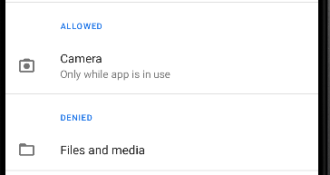

# Questions:

### **a) Add a new Activity class to my project, and my application keeps crashing. What did I do wrong?**

The activity is not declared in the manifest:

```xml
<activity
	android:name=".MainActivity"
	android:exported="true">
	<intent-filter>
		<action android:name="android.intent.action.MAIN" />
		<category android:name="android.intent.category.LAUNCHER" />
	</intent-filter>
	<meta-data
		android:name="android.app.lib_name"
		android:value="" />
</activity>
```

### **b) True or False: Every Android application needs an Android manifest file.**

True, every android application need `AndroidManifest.xml`

### **c) True or False: The android:versionCode numbers must correspond with the application android:versionName**

No, the `versionCode` is a number that is used to determine if one version is newer than another. This number is not shown to users but is used to define the version number within the Play Store.
The `versionName` is to display the version number of the application to users.

### **d) What is the permission for using the camera?**
```xml
<uses-permission android:name="android.permission.CAMERA" />
```

### **e) True or False: When installing an application, the user is shown the permissions requested in the Android manifest file.**

True, the user can see the permissions that the application has by going to the `application information`.

